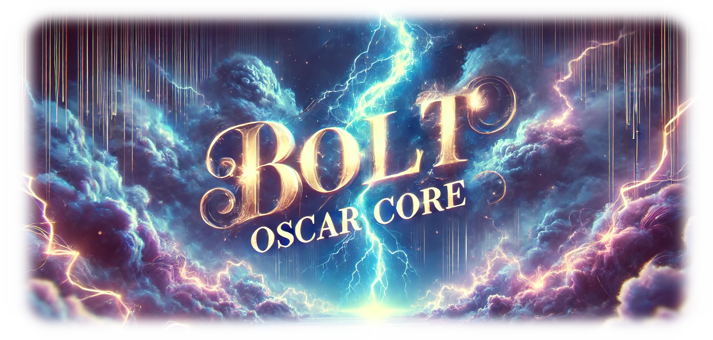

<p align="center">
  
  <h1 align="center">🌟 bolt.Oscar-Core 🌟</h1>
</p>
<p align="center">
  <a href="https://github.com/Sunwood-ai-labs/bolt.Oscar-core">
    
  </a>
  <a href="https://github.com/Sunwood-ai-labs/bolt.Oscar-core/blob/main/LICENSE">
    
  </a>
  <a href="https://github.com/Sunwood-ai-labs/bolt.Oscar-core/stargazers">
    
  </a>
  <a href="https://github.com/Sunwood-ai-labs/bolt.Oscar-core/releases">
    
  </a>
</p>
<h2 align="center">
  ～ AI駆動型フルスタック Web開発コアテンプレート ～

<a href="https://github.com/Sunwood-ai-labs/bolt.Oscar-core/blob/main/README.md"></a>
<a href="https://github.com/Sunwood-ai-labs/bolt.Oscar-core/blob/main/docs/README.en.md"></a>
</h2>
<p align="center">
  
  
  
  
  
  
</p>

> [!IMPORTANT]
> bolt.Oscar-coreは、[Bolt.new](https://github.com/stackblitz/bolt.new)を活用して開発された、AI駆動型Web開発環境のためのテンプレートです。このリポジトリは、独自のAI開発エージェントを構築するプロセスを簡素化することを目的としています。

## 🚀 プロジェクト概要

bolt.Oscar-coreは、Bolt.newをベースにしたAI駆動型Web開発環境を構築するためのテンプレートです。ブラウザから直接フルスタックアプリケーションを作成、実行、デプロイするために必要な基本機能を提供します。バージョン0.1.0では、WebContainersを使用したAI駆動開発のための基本インフラストラクチャの確立に焦点を当てています。

## ✨ 主な機能

- WebContainersを活用したフルスタック開発環境
- 統合されたAIモデルサポート（Anthropic、OpenAI、Groq、Ollama）
- リアルタイムのパッケージインストールと管理
- Node.jsサーバーの実行機能
- ブラウザベースの開発環境
- 最新のWebフレームワークとツールのサポート

## 🔧 はじめ方

### 前提条件
- Node.js (v20.15.1)
- pnpm (v9.4.0)
- Chrome Canary（ローカル開発に必要）

### セットアップ手順

1. リポジトリのクローン:
```bash
git clone https://github.com/Sunwood-ai-labs/bolt.Oscar-core
cd bolt.Oscar-core
```

2. 依存関係のインストール:
```bash
pnpm install
```

3. 環境変数の設定:
```bash
cp .env.example .env.local
```

.env.localにLLM APIキーを追加:
```
GROQ_API_KEY=XXX
OPENAI_API_KEY=XXX
ANTHROPIC_API_KEY=XXX
```

4. 開発サーバーの起動:
```bash
pnpm run dev
```

## 📦 プロジェクト構成

```plaintext
├─ app/
│  ├─ components/     # Reactコンポーネント
│  ├─ hooks/         # カスタムReactフック
│  ├─ utils/         # ユーティリティ関数
│  ├─ models/        # AIモデル統合
│  ├─ containers/    # WebContainer設定
├─ public/           # 静的アセット
├─ scripts/          # ビルドとデプロイスクリプト
├─ tests/           # テストファイル
├─ types/           # TypeScript型定義
```

## 🛠️ 利用可能なスクリプト

- `pnpm run dev`: 開発サーバーの起動
- `pnpm run build`: プロジェクトのビルド
- `pnpm run preview`: プロダクションビルドのプレビュー
- `pnpm test`: テストの実行
- `pnpm run typecheck`: TypeScript型チェックの実行

## 🔄 新しいAIモデルの追加

新しいAIモデルを追加するには、`app/utils/constants.ts`を修正します：

```typescript
export const MODEL_LIST = [
  {
    name: "model-id",
    label: "モデル表示名",
    provider: "プロバイダー名"
  }
  // さらにモデルを追加
];
```

## 🌿 開発のヒント

- ローカル開発にはChrome Canaryを使用
- デバッグログを有効にするには`VITE_LOG_LEVEL=debug`を設定
- より良いAI対話のためにプロンプト強化機能を活用
- 複雑な機能を追加する前に基本的なスカフォールディングから始める


## 🐳 Docker開発ガイド

### Dockerファイルの構成

プロジェクトには以下の Docker 関連ファイルが含まれています：

1. `Dockerfile`:
```dockerfile
FROM node:latest

WORKDIR /app

COPY . .
RUN rm -rf node_modules

# Install pnpm globally
RUN npm install -g pnpm

# Install dependencies
RUN pnpm install

# Make sure bindings.sh is executable
RUN chmod 777 bindings.sh

EXPOSE 5173

CMD pnpm run dev
```

2. `docker-compose.yml`:
```yaml
version: '3.8'

services:
  app:
    build:
      context: .
      dockerfile: Dockerfile
    image: 498218886114.dkr.ecr.ap-northeast-1.amazonaws.com/bolt-oscar-app:latest
    ports:
      - "8788:8788"
      - "5173:5173"
    environment:
      - NODE_ENV=development
    command: pnpm run dev
```

### 🏗️ Dockerイメージのビルドとプッシュ

#### DockerHubへのプッシュ

1. ローカルでイメージをビルド:
```bash
# 最新バージョン
docker build -t bolt:latest .

# 特定のバージョン
docker build --no-cache -t bolt:v0.3.3 .
```

2. DockerHubのタグを付与:
```bash
docker tag bolt:v0.3.3 makisunwood/bolt:v0.3.3
```

3. DockerHubにプッシュ:
```bash
docker push makisunwood/bolt:v0.3.3
```

#### Amazon ECRへのプッシュ

1. ECRリポジトリの作成:
```bash
aws ecr create-repository --repository-name bolt-oscar-app --region ap-northeast-1
```

2. ECRへのログイン:
```bash
aws ecr get-login-password --region ap-northeast-1 | docker login --username AWS --password-stdin 498218886114.dkr.ecr.ap-northeast-1.amazonaws.com
```

3. ECR用のタグ付け:
```bash
docker tag bolt-oscar-app:latest 498218886114.dkr.ecr.ap-northeast-1.amazonaws.com/bolt-oscar-app:latest
```

4. ECRへプッシュ:
```bash
docker push 498218886114.dkr.ecr.ap-northeast-1.amazonaws.com/bolt-oscar-app:latest
```

### 🔄 ローカルでのDocker実行

Dockerイメージをローカルで実行するには：

```bash
# Docker Composeを使用する場合
docker-compose up

# 直接Dockerを使用する場合
docker run -p 5173:5173 bolt:latest
```

> [!TIP]
> - 開発時は `docker-compose up` の使用を推奨します
> - プロダクション用のイメージをビルドする際は、必ず `--no-cache` オプションを使用してください
> - バージョン管理のため、`:latest` タグの代わりに具体的なバージョンタグを使用することを推奨します

## 🔍 トラブルシューティング

### よくある問題と解決方法

1. ポートの競合:
```bash
# 使用中のポートを確認
lsof -i :5173
# 競合するプロセスの終了
kill -9 <PID>
```

2. パーミッションエラー:
```bash
# bindings.shの実行権限を確認
ls -l bindings.sh
# 必要に応じて権限を付与
chmod +x bindings.sh
```

## 🤝 コントリビューション

1. リポジトリをフォーク
2. 機能ブランチを作成 (`git checkout -b feature/amazing-feature`)
3. 変更をコミット (`git commit -m '素晴らしい機能を追加'`)
4. ブランチにプッシュ (`git push origin feature/amazing-feature`)
5. プルリクエストを作成

## 📄 ライセンス

bolt.Oscar-coreは[MITライセンス](LICENSE)の下で公開されています。

## 🙏 謝辞

- オリジナルのインスピレーションを提供してくださった[Bolt.new](https://github.com/stackblitz/bolt.new)チーム
- WebContainers技術を提供してくださった[StackBlitz](https://stackblitz.com/)
- すべてのコントリビューターとコミュニティメンバー

---

bolt.Oscar-coreで、あなただけのAI駆動開発環境を構築しましょう！
